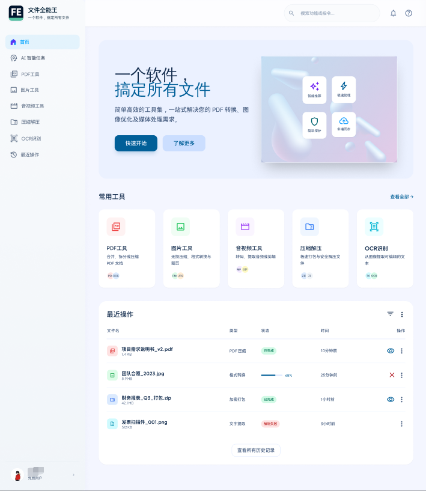
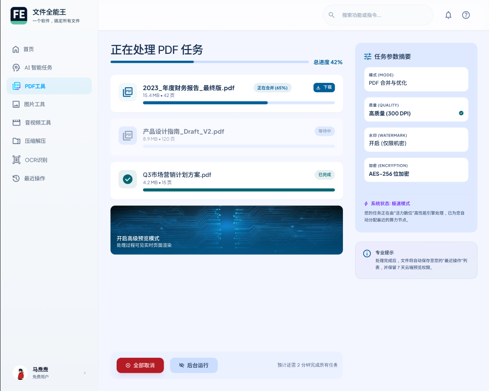
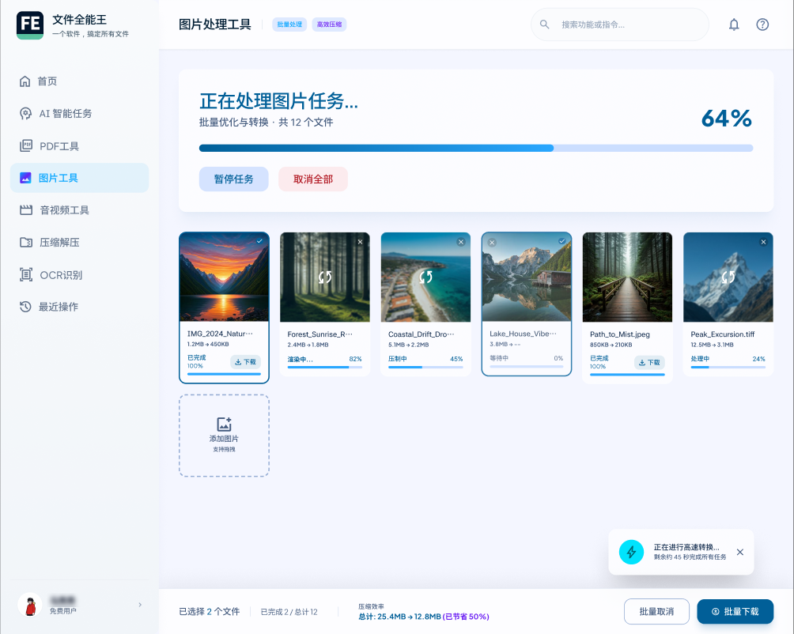
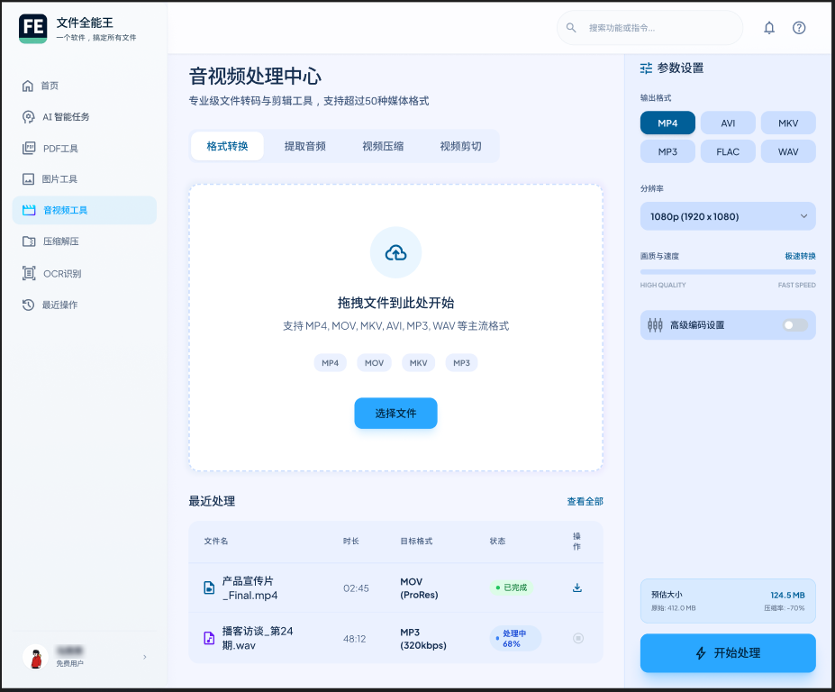

<div align="center">

# File Toolkit（文件全能王）

**本地离线 · 安全可靠 · 现代美观 · 一站式文件处理**

一款跨平台本地文件处理桌面工具，覆盖 PDF、图片、音视频、压缩解压、OCR 五大场景。
所有文件处理均在本地完成，不上传任何数据。

[](https://python.org)
[](https://flet.dev)
[](LICENSE)
[](https://github.com/kekemao00/file-toolkit)

</div>

---

<!-- 截图展示区 — 替换为实际截图后删除注释 -->
<div align="center">
<table>
<tr>
<td align="center"><b>首页</b></td>
<td align="center"><b>PDF 工具</b></td>
</tr>
<tr>
<td></td>
<td></td>
</tr>
<tr>
<td align="center"><b>图片工具</b></td>
<td align="center"><b>音视频工具</b></td>
</tr>
<tr>
<td></td>
<td></td>
</tr>
</table>

> 💡 截图待补充：运行应用后截取各页面，保存至 `docs/screenshots/` 目录

</div>

---

## 功能矩阵

### 📄 PDF 工具

| 功能 | 说明 | 离线 |
|---|---|:---:|
| PDF 分割 | 按页数 / 按范围 / 每页单独拆分 | ✅ |
| PDF 合并 | 多文件合并，支持拖拽排序 | ✅ |
| PDF 压缩 | 可选压缩质量（高 / 中 / 低） | ✅ |
| PDF → Word | 还原排版转为 `.docx` | ✅ |
| PDF → Excel | 表格提取转为 `.xlsx` | ✅ |
| PDF → PPT | 转为 `.pptx` | ✅ |
| Office → PDF | Word / Excel / PPT 转 PDF | ✅ |

### 🖼️ 图片工具

| 功能 | 说明 | 离线 |
|---|---|:---:|
| 格式转换 | JPG / PNG / WebP / BMP / TIFF 互转 | ✅ |
| 批量压缩 | 三档压缩级别（轻度 / 标准 / 极限） | ✅ |
| 添加水印 | 文字水印，支持位置 / 透明度 / 字号 / 平铺 | ✅ |
| 批量重命名 | 模板变量：`{name}` `{n}` `{date}` `{ext}` | ✅ |

### 🎬 音视频工具

| 功能 | 说明 | 离线 |
|---|---|:---:|
| 视频格式转换 | MP4 / AVI / MKV / MOV / WebM 互转 | ✅ |
| 视频压缩 | 三档质量 + 分辨率选择（1080p / 720p / 480p） | ✅ |
| 视频剪辑 | 按时间段裁剪（HH:MM:SS） | ✅ |
| 音频提取 | 从视频提取 MP3 / WAV / FLAC / AAC | ✅ |
| 音频格式转换 | MP3 / WAV / FLAC / AAC / OGG 互转，可选比特率 | ✅ |

### 📦 压缩解压

| 功能 | 说明 | 离线 |
|---|---|:---:|
| 压缩 | zip / 7z / tar.gz | ✅ |
| 解压 | zip / 7z / rar / tar.gz | ✅ |
| 加密压缩 | 支持密码保护 | ✅ |
| 分卷压缩 | 按大小分卷 | ✅ |

### 🔍 OCR 识别 &nbsp;·&nbsp; 🤖 AI 智能任务

| 功能 | 说明 | 离线 |
|---|---|:---:|
| 图片文字识别 | 百度 / 腾讯 OCR API | ❌ 联网 |
| AI 智能处理 | 自然语言描述任务，AI 自动执行 | ❌ 联网 |

---

## 技术架构

```
┌─────────────────────────────────────────────────────────────┐
│                        UI Layer                              │
│  Flet (Flutter Engine) · Material Design 3 · 深色/浅色主题   │
│  22 pages · 11 components · router.py (23 routes)           │
└──────────────────────────┬──────────────────────────────────┘
                           │
┌──────────────────────────▼──────────────────────────────────┐
│                      Service Layer                           │
│  TaskService · HistoryService · SettingsService              │
│  参数验证 → 任务调度 → 进度回调 → 结果封装                    │
└──────────────────────────┬──────────────────────────────────┘
                           │
┌──────────────────────────▼──────────────────────────────────┐
│                      Core Engine                             │
│  ┌───────────┐ ┌────────────┐ ┌──────────┐ ┌────────────┐  │
│  │ core/pdf/ │ │core/image/ │ │core/media│ │core/archive│  │
│  │ pypdf     │ │ Pillow     │ │ ffmpeg   │ │ py7zr      │  │
│  │ pikepdf   │ │ pillow-heif│ │ -python  │ │ rarfile    │  │
│  │ pdf2docx  │ │            │ │          │ │ zipfile    │  │
│  └───────────┘ └────────────┘ └──────────┘ └────────────┘  │
│  ┌────────────────────────────────────────────────────────┐ │
│  │  platform.py — FFmpeg / LibreOffice 路径检测与注入      │ │
│  └────────────────────────────────────────────────────────┘ │
└──────────────────────────┬──────────────────────────────────┘
                           │ 可选联网
┌──────────────────────────▼──────────────────────────────────┐
│                     Cloud API Layer                          │
│  OCR：百度 / 腾讯 OCR API（httpx 异步调用）                  │
└─────────────────────────────────────────────────────────────┘
```

### 核心技术栈

| 层级 | 选型 | 版本 | 说明 |
|---|---|---|---|
| UI 框架 | Flet | >= 0.24 | Flutter 渲染引擎，Material Design 3 |
| 运行时 | Python | >= 3.11 | asyncio + ThreadPoolExecutor 异步模型 |
| PDF 处理 | pypdf + pikepdf | 4.x / 9.x | 分割 / 合并 / 加密 / 压缩 |
| PDF↔Office | pdf2docx + LibreOffice CLI | 0.5.x | PDF→Word + Office→PDF |
| 图片处理 | Pillow + pillow-heif | 10.x / 0.16.x | 含 HEIC/HEIF 格式支持 |
| 音视频处理 | ffmpeg-python | 0.2.x | 需内嵌 FFmpeg 二进制（LGPL） |
| 压缩解压 | py7zr + rarfile + zipfile | 0.21.x / 4.x | 7z / rar / zip / tar.gz |
| HTTP 客户端 | httpx | >= 0.27 | OCR API 异步调用 |
| 本地存储 | SQLite | 内置 | 任务历史 + 设置持久化 |
| 打包 | PyInstaller + flet build | — | Windows .exe 输出 |

### 外部二进制依赖

| 依赖 | 版本 | 内嵌方式 | 授权 |
|---|---|---|---|
| FFmpeg | 7.x | `assets/bin/ffmpeg.exe` | LGPL v2.1 |
| LibreOffice | 24.x | 按需检测系统安装，未安装时引导下载 | MPL v2 |

---

## 快速开始

### 环境要求

- Python >= 3.11
- [uv](https://docs.astral.sh/uv/)（推荐）或 pip
- FFmpeg（音视频功能需要）
- LibreOffice（Office↔PDF 功能需要，可选）

### 安装与运行

```bash
# 克隆项目
git clone https://github.com/kekemao00/file-toolkit.git
cd file-toolkit/file-toolkit

# 安装依赖
uv sync

# 启动应用
uv run python main.py
```

### 打包（Windows）

```bat
cd file-toolkit
flet build windows --product-name "File Toolkit" --product-version "1.0.0"
```

---

## 项目结构

```
file-toolkit/
├── main.py                    # 应用入口：窗口配置、字体注册、路由初始化
├── pyproject.toml             # 项目配置、依赖声明
├── assets/
│   ├── fonts/                 # Manrope（标题）+ Inter（正文）
│   └── icons/                 # 应用图标
├── core/                      # 核心引擎层（纯 Python，无 UI 依赖）
│   ├── pdf/                   # splitter / merger / compressor / converter / encryptor / watermark
│   ├── image/                 # converter / compressor / watermark / renamer
│   ├── media/                 # video.py / audio.py
│   ├── archive/               # handler.py（zip / 7z / rar / tar）
│   ├── ocr/                   # client.py（百度 / 腾讯 OCR）
│   ├── models.py              # 统一数据模型（TaskResult 等）
│   └── platform.py            # FFmpeg / LibreOffice 路径检测
├── services/                  # 服务层
│   ├── task_service.py        # 异步任务调度 + 进度回调
│   ├── history_service.py     # SQLite 任务历史
│   └── settings_service.py    # 用户设置持久化
├── ui/                        # UI 层（Flet）
│   ├── router.py              # 23 条路由映射
│   ├── theme.py               # Material Design 3 主题配置
│   ├── components/            # 11 个可复用组件
│   │   ├── nav_rail.py        # 侧边导航栏（可折叠）
│   │   ├── top_bar.py         # 毛玻璃顶部栏
│   │   ├── sub_page_header.py # 子页面统一标题栏
│   │   ├── drop_zone.py       # 拖拽文件区域
│   │   ├── action_card.py     # 功能入口卡片
│   │   ├── progress_card.py   # 任务进度卡片
│   │   ├── result_card.py     # 结果展示卡片
│   │   └── ...
│   └── pages/                 # 22 个页面
│       ├── home_page.py       # 首页（快速入口 + 最近任务）
│       ├── pdf_page.py        # PDF 工具列表
│       ├── image_page.py      # 图片工具列表
│       ├── media_page.py      # 音视频工具列表
│       ├── settings_page.py   # 设置（外观 / 文件 / OCR / 关于）
│       └── ...                # 各操作子页面
└── tests/                     # 测试
    ├── core/                  # 核心引擎单元测试
    └── services/              # 服务层单元测试
```

---

## 设计系统

基于 Figma「The Fluid Architect」设计系统，通过 Figma MCP 1:1 还原至代码。

### 色彩

| Token | 值 | 用途 |
|---|---|---|
| `primary` | `#005f98` | 主按钮、CTA 渐变起点 |
| `primary-light` | `#2aa7ff` | CTA 渐变终点 |
| `surface` | `#f4f6ff` | 页面背景 |
| `surface-card` | `#ffffff` | 卡片背景 |
| `on-surface` | `#162f50` | 主文字 |
| `on-surface-variant` | `#455c7f` | 辅助文字 |
| `error` | `#dc2626` | 错误状态 / PDF 模块强调 |
| `success` | `#16a34a` | 成功状态 |

### 字体

| 用途 | 字体 | 场景 |
|---|---|---|
| 标题 / Display | **Manrope** | 页面标题、卡片标题、按钮文字 |
| 正文 / Label | **Inter** | 说明文字、表单标签 |

### 圆角

| 元素 | 圆角 |
|---|---|
| 功能卡片 | 24px |
| 标准卡片 / 按钮 | 16px |
| 输入框 / 下拉框 | 12px |
| 搜索框 / 进度条 | 9999px（pill） |

---

## 开发指南

```bash
cd file-toolkit

# 运行测试
uv run pytest

# 代码检查
uv run ruff check .

# 类型检查
uv run mypy .
```

### 异步任务模型

```
用户点击"开始"
    │
    ▼
TaskService.submit(task_params)
    ├── 参数验证（同步）
    ▼
asyncio.run_in_executor(ThreadPoolExecutor, core_function)
    ├── 进度回调：progress_callback(current, total, desc)
    ▼
UI 层 page.update() 刷新进度条
    ▼
完成 → HistoryService.save(task_result)
    ▼
UI 展示结果（文件列表 + 打开目录）
```

---

## 路线图

| 阶段 | 平台 | 交付物 | 状态 |
|---|---|---|---|
| **Phase 1** | Windows | `.exe` 安装包 | 🚧 开发中 |
| Phase 2 | macOS / Linux | `.dmg` / `.app` / AppImage / `.deb` | 📋 计划中 |
| Phase 3 | Android / iOS | 原生 Kotlin + FastAPI 服务 / Flet 打包 | 📋 计划中 |

### V2 迭代功能

- [ ] PDF 加密 / 解密
- [ ] PDF 水印
- [ ] 图片裁剪 / 旋转
- [ ] Excel ↔ CSV / JSON
- [ ] 二维码生成 / 识别
- [ ] 文件哈希校验（MD5 / SHA256）

---

## 文档

| 文档 | 说明 |
|---|---|
| [完整需求文档](docs/File%20Toolkit%20完整需求文档.md) | 产品定位、功能清单、平台策略 |
| [技术开发文档](docs/File%20Toolkit%20技术开发文档.md) | 架构设计、技术选型、接口规范 |
| [设计原型文档](docs/File%20Toolkit%20设计原型文档.md) | 视觉规范、页面原型、交互流程 |
| [产品全景图](docs/File%20Toolkit%20产品全景.png) | 功能模块全景思维导图 |
| [产品全景脑图](docs/File%20Toolkit%20产品全景.xmind) | XMind 源文件 |

---

## 授权

[MIT License](LICENSE)

Copyright © 2026 kekemao00
