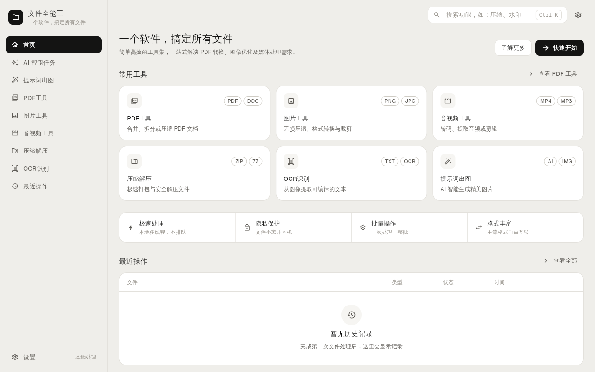
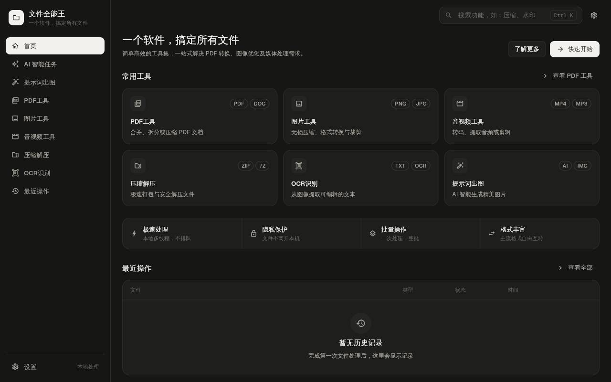
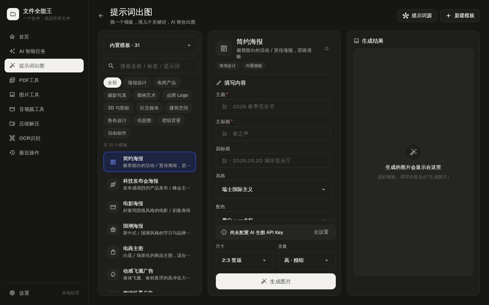
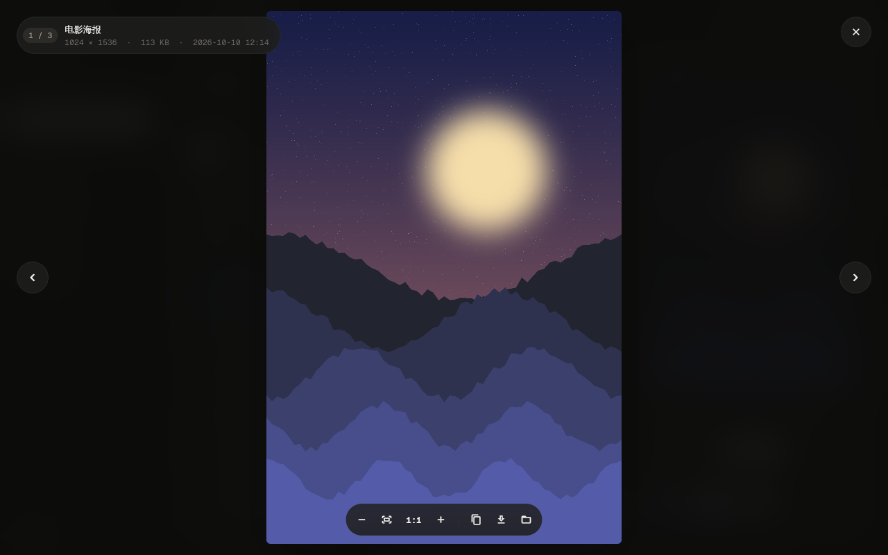
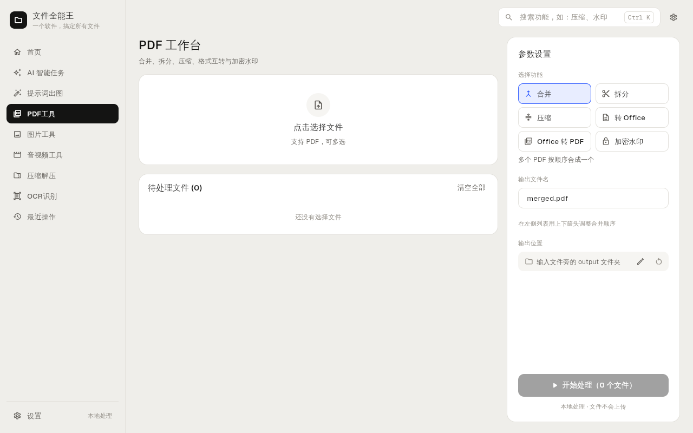
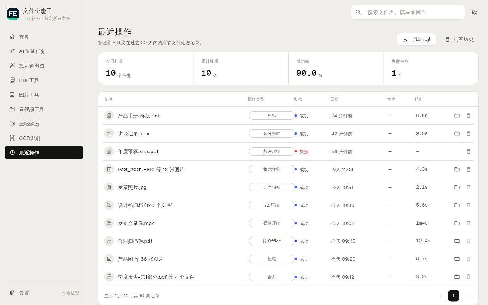
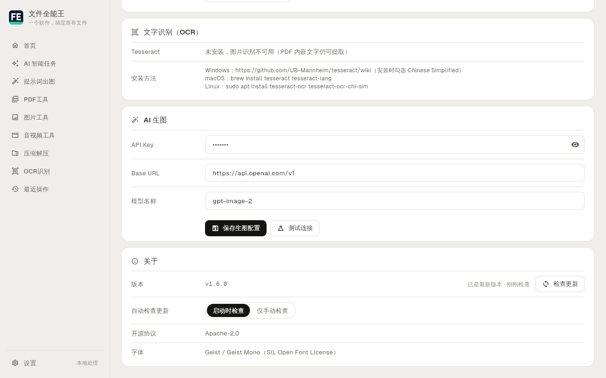
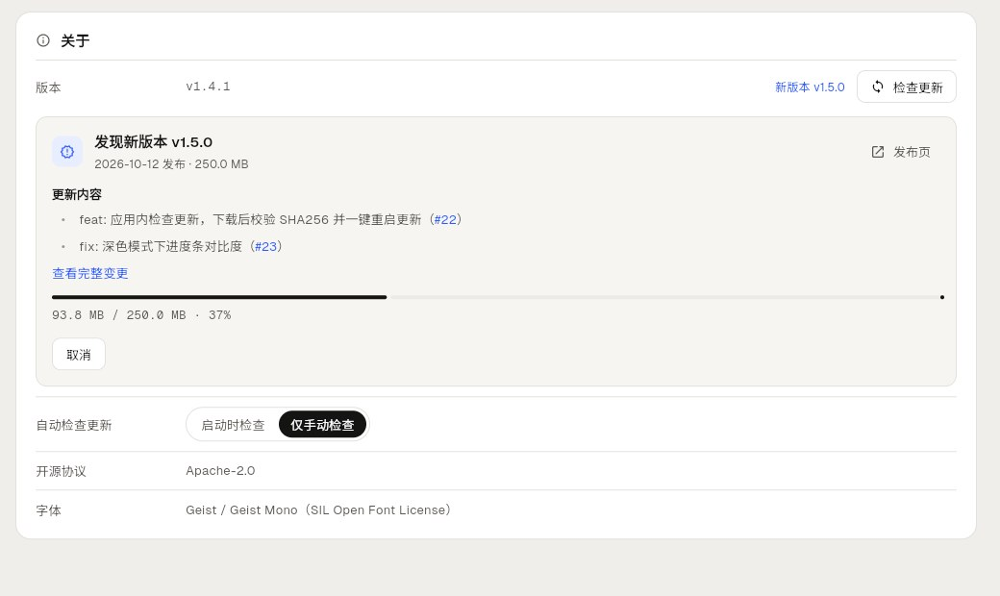
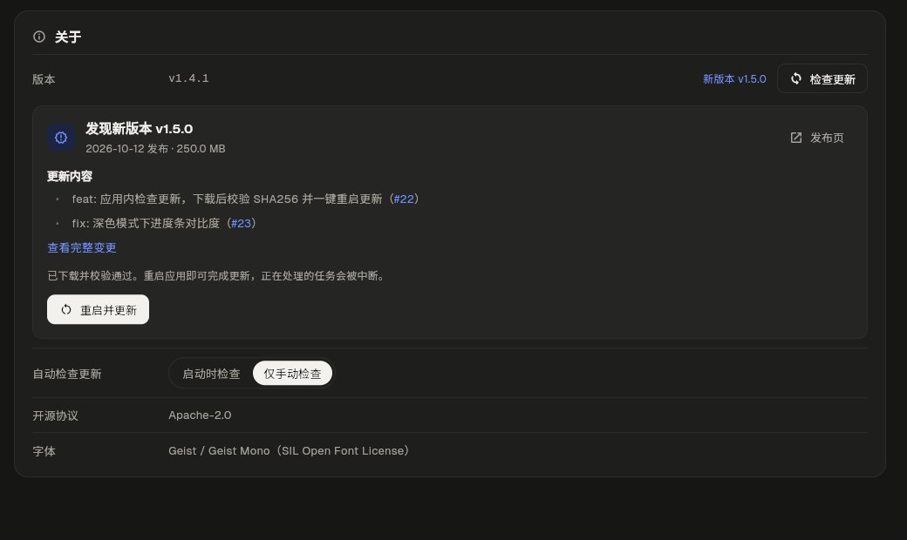

<div align="center">

# File Toolkit · 文件全能王

**本地处理 PDF、图片、音视频与压缩包的跨平台桌面工具箱**

文件只在你自己的电脑上处理，不经过任何服务器。

[](https://github.com/kekemao00/FileToolkit/actions/workflows/ci.yml)
[](https://github.com/kekemao00/FileToolkit/releases)
[](#下载安装)
[](LICENSE)

[下载](#下载安装) · [功能](#功能) · [截图](#截图) · [从源码运行](#从源码运行) · [打包与发布](#打包与发布)

<picture>
  <source media="(prefers-color-scheme: dark)" srcset="docs/screenshots/home-dark.png">
  
</picture>

</div>

## 下载安装

到 [Releases](https://github.com/kekemao00/FileToolkit/releases/latest) 下载对应平台的安装包：

| 平台 | 文件 | 说明 |
|---|---|---|
| Windows 10/11 (x64) | `FileToolkit-<版本>-windows-x64.zip` | 解压后运行 `FileToolkit` 文件夹里的 `.exe`；SmartScreen 拦截时选「更多信息 → 仍要运行」 |
| macOS (Apple 芯片) | `FileToolkit-<版本>-macos-arm64.zip` | 解压后把 `.app` 拖进「应用程序」，首次打开请右键 → 打开（应用暂未签名） |
| Linux (x64) | `FileToolkit-<版本>-linux-x64.tar.gz` | `tar -xzf` 解压后运行 `FileToolkit/` 里的可执行文件；运行一次 `./install-desktop-entry.sh` 可加入应用菜单（带图标） |

每个版本都附带 `SHA256SUMS.txt`，可用 `sha256sum -c SHA256SUMS.txt` 校验下载是否完整。

> macOS 提示「已损坏，无法打开」时，执行 `xattr -dr com.apple.quarantine "/Applications/<应用名>.app"` 后再打开。

装好之后，新版本可以直接在应用里更新：「设置 → 关于 → 检查更新」（默认启动时也会检查一次正式版）。应用会下载当前平台的安装包、按 `SHA256SUMS.txt` 校验，点「重启并更新」即替换并重新打开。程序放在没有写权限的位置（如 `C:\Program Files`）、或 macOS 上直接从「下载」里运行时，会改为打开解压好的新版本文件夹，由你手动替换。

## 功能

✅ 开箱即用 &nbsp; 🔧 需要先装外部程序或填写 API Key（见[外部依赖](#外部依赖)） &nbsp; 🚧 开发中

| 分类 | 功能 | 状态 |
|---|---|:---:|
| **PDF** | 合并、拆分（按页数 / 范围 / 逐页）、压缩 | ✅ |
| | 加文字水印、设置打开密码 | ✅ |
| | PDF 转 Word、Excel（表格提取）、PPT（每页保留原版式） | ✅ |
| | PDF 转图片（PNG / JPG，可选清晰度）；压缩后显示省了多少 | ✅ |
| | Word / Excel / PPT 转 PDF | 🔧 LibreOffice |
| **图片** | 格式转换（JPG / PNG / WebP / BMP / TIFF / HEIC） | ✅ |
| | 批量压缩、尺寸调整、文字水印、批量重命名（`{name}` `{n}` `{date}` `{ext}` 模板） | ✅ |
| | 多张图片合成一个 PDF（按原尺寸或 A4 排版，可调顺序） | ✅ |
| **音视频** | 视频格式转换、压缩（可选分辨率）、按时间段剪辑，处理时显示实时进度 | ✅ 内置 FFmpeg |
| | 从视频提取音频、音频格式转换 | ✅ 内置 FFmpeg |
| **压缩解压** | 文件和文件夹压缩为 ZIP / 7Z / TAR.GZ，7Z 可设密码 | ✅ |
| | 批量解压 ZIP / 7Z / TAR（每个包单独一个文件夹，支持带密码的 ZIP / 7Z，Windows 中文文件名不乱码） | ✅ |
| | 解压 RAR | 🔧 unrar |
| **文字识别** | 从图片、扫描版 PDF 识别文字（中文 / 英文 / 日文） | 🔧 Tesseract |
| | 提取 PDF 内嵌文字 | ✅ |
| **AI** | 提示词出图（OpenAI Images 兼容接口），可附最多 8 张参考图生成合照、婚纱照、集体照；保留最近作品 | 🔧 API Key |
| | 全窗口看图器：滚轮缩放、拖动平移、双击切换 1:1 原图像素，左右键切换作品，右键复制图片 | 🔧 API Key |
| | 13 类 35 个内置模板；风格增强词与反向提示词；「我的模板」支持 `{变量}`、收藏与导出 | 🔧 API Key |
| | 一键导入开源提示词库（Awesome GPT-4o Images、Awesome GPT Image 2 Prompts，注明出处），或从网址 / JSON / CSV / Markdown 导入 | 🔧 API Key |
| | 智能入口：一句话描述需求（如「图片转 PDF 再加水印」），拆成步骤并带着文件打开对应工具 | ✅ |
| **应用** | 全局功能搜索、最近操作记录、偏好设置；批量处理中某个文件失败不影响其余文件，输出不会覆盖已有文件 | ✅ |
| | 应用内检查更新：查看更新说明，下载校验后一键重启更新 | ✅ |
| | 应用内问题反馈 / 功能建议：自动填好系统、版本和安装方式，在浏览器打开预填好的 GitHub Issue | ✅ |
| | 暖灰 / 墨色界面风格（Geist 字体），浅色与深色模式；顶部浮岛式提示，清空记录、删除模板前在窗口内确认 | ✅ |

### 外部依赖

只有对应功能才需要，其他功能不受影响。

| 程序 | 用于 | 获取方式 |
|---|---|---|
| FFmpeg | 音视频全部功能 | **三个平台的安装包都已内置**；源码运行时放到 `file-toolkit/assets/bin/` 或装到系统 PATH（macOS 可 `brew install ffmpeg`） |
| LibreOffice | Office 转 PDF | [官网下载](https://www.libreoffice.org/download/)，装在默认位置或 PATH 中即可被识别 |
| Tesseract | 图片文字识别 | Windows：[UB-Mannheim 安装包](https://github.com/UB-Mannheim/tesseract/wiki)；macOS：`brew install tesseract tesseract-lang`；Linux：`sudo apt install tesseract-ocr tesseract-ocr-chi-sim` |
| unrar | 解压 RAR | macOS：`brew install rar`；Linux：`sudo apt install unrar`；Windows：安装 [WinRAR](https://www.win-rar.com/) 或 7-Zip 并加入 PATH |
| API Key | 提示词出图 | 在应用「设置」里填写 API Key，可改 Base URL 与模型以接入兼容服务 |

## 截图

| 浅色 | 深色 |
|---|---|
|  |  |
|  |  |
|  |  |

| PDF 工作台 | 操作记录 | 设置与检查更新 |
|---|---|---|
|  |  |  |

<details>
<summary>应用内更新</summary>

| 发现新版本 | 下载中 | 重启并更新 |
|---|---|---|
|  |  |  |

</details>

## 从源码运行

需要 Python 3.11+ 和 [uv](https://docs.astral.sh/uv/getting-started/installation/)。

```bash
git clone https://github.com/kekemao00/FileToolkit.git
cd FileToolkit/file-toolkit
uv sync
uv run python main.py
```

运行数据（数据库、设置）保存在 `file-toolkit/.data/`，打包后的应用改存到系统的用户数据目录。

## 开发

```bash
cd file-toolkit
uv sync --all-groups   # 运行、测试、打包依赖全部装上
uv run ruff check .    # 代码检查
uv run pytest          # 单元测试
```

每次推送到 `main` 和每个 PR 都会在 [CI](.github/workflows/ci.yml) 里跑上面两项检查。

```
file-toolkit/
├── main.py        # 入口：窗口、字体、主题、路由
├── core/          # 处理引擎（纯 Python，不依赖 UI）：pdf / image / media / archive / ocr
├── services/      # 任务调度、历史记录、设置持久化（SQLite）
├── ui/            # Flet 界面：router、主题、组件、页面
│   └── features.py  # 功能目录，首页入口与全局搜索共用；新增功能在这里登记
├── assets/        # 字体、图标；打包时 FFmpeg 放到 assets/bin/
├── build/         # 各平台打包脚本
└── tests/         # pytest 单元测试，目录结构与源码对应
```

技术栈：[Flet](https://flet.dev) 0.84（Flutter 渲染）、pypdf / pikepdf / pypdfium2 / pdf2docx、Pillow、FFmpeg、Tesseract、py7zr。更多设计细节见 [docs/](docs/) 下的需求、技术与设计文档。

## 打包与发布

### 本地打包

桌面应用只能在对应系统上打包（flet 不支持交叉编译）。产品名、Bundle ID 等元数据写在 `pyproject.toml` 的 `[tool.flet]`，版本号取自 `[project].version`。首次打包会自动下载所需的 Flutter SDK。

```bash
cd file-toolkit
bash build/build_macos.sh          # macOS，MACOS_ARCH=x86_64 / universal 可切换架构
bash build/build_linux.sh          # Linux，需 libgtk-3-dev clang cmake ninja-build
build\build_windows.bat            # Windows
```

产物在 `file-toolkit/build/<平台>/`。想把 FFmpeg 打进包里，先把二进制放到 `file-toolkit/assets/bin/`。

### 发布新版本

[Release 工作流](.github/workflows/release.yml) 在推送版本 tag 时自动测试、三平台打包并创建 GitHub Release：

1. 修改 `file-toolkit/pyproject.toml` 里的 `version`，然后在 `file-toolkit/` 下执行 `uv lock` 同步锁文件。
2. 提交并合入 `main`。
3. 二选一：
   - 在 GitHub 的 Actions 页面打开 Release 工作流，点「Run workflow」，分支选 `main` 并勾选「发布」。工作流会自动打 `v<版本号>` tag，手机网页上也能操作。
   - 或者自己打 tag 并推送，tag 必须是 `v` + 同一个版本号：
     ```bash
     git tag v1.4.0
     git push origin v1.4.0
     ```

tag 与 `pyproject.toml` 版本不一致、或该版本已经发过时，工作流会直接失败，不会发出错误版本号的安装包。带 `-` 的版本（如 `v1.4.0-beta.1`）发布为预发布版。Release 说明由 GitHub 根据合入的 PR 自动生成。

只想试打包、不发布时，手动运行时不勾选「发布」，安装包会作为构建产物上传；改动打包相关文件的 PR 也会自动试打包一次。

## 许可证

本项目基于 [Apache License 2.0](LICENSE) 开源。Copyright © 2026 kekemao00

安装包内置的 FFmpeg（Windows / Linux 来自 [BtbN/FFmpeg-Builds](https://github.com/BtbN/FFmpeg-Builds)，macOS 来自 [ffmpeg.martin-riedl.de](https://ffmpeg.martin-riedl.de)）以 GPL 授权单独分发。

界面字体 [Geist / Geist Mono](https://github.com/vercel/geist-font) 以 SIL Open Font License 1.1 授权，许可证全文见 `file-toolkit/assets/fonts/Geist-OFL.txt`。
